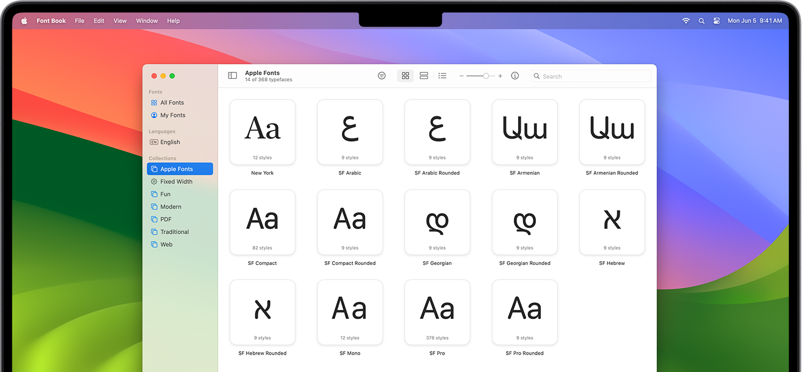

# Apple system fonts

This repository provides the fonts for the Apple system.

The fonts are extracted from the .dmg files, which can be obtained at https://developer.apple.com/fonts/.

The available fonts are:

* **SF core fonts**
    * SF Pro
    * SF Compact
    * SF Mono
    * New York
* **SF Script Extensions**
    * SF Arabic
    * SF Armenian
    * SF Georgian
    * SF Hebrew



## Prerequisites

### `p7zip-full`

The [`p7zip-full`](https://p7zip.sourceforge.net/) package, which provides the `7z` command, is required for extracting the `.dmg` files.

You can download it at https://sourceforge.net/projects/p7zip/.

## Download the `.dmg` files

Download the `.dmg` files from [Apple's website](https://developer.apple.com/fonts/):

```bash
make dmg -j
```

## Extract fonts

Run

```bash
make -j
```

to extract the fonts from the `.dmg` files, and pack all extracted files into the `Apple-system-fonts.zip` file.

Or, you can run the two steps separately:

1. Extract all fonts (will download the `.dmg` files first if not present):

    ```bash
    make fonts -j
    ```
2. Extract and pack all fonts into `Apple-system-fonts.zip`:

    ```bash
    make zip -j
    ```

## Create a release

Run

```bash
make release -j
```

to create the `release` directory, and create symlinks to `.dmg` files as well as the `Apple-system-fonts.zip` file in this directory.

## Clean up

* Clean up generated fonts (removes the `release` directory, the `Apple-system-fonts.zip` file, and the `fonts` directory):

    ```bash
    make clean
    ```
* Clean up the `release` directory:

    ```bash
    make clean_release
    ```
* Clean up the generated `Apple-system-fonts.zip` file:

    ```bash
    make clean_zip
    ```
* Clean up the `fonts` directory:

    ```bash
    make clean_fonts
    ```
* Clean up the `.dmg` files:

    ```bash
    make clean_dmg
    ```
* Clean up all of them:

    ```bash
    make clean_all
    ```

## See also

* [SF Symbols](https://github.com/mobiledesres/SF-Symbols)